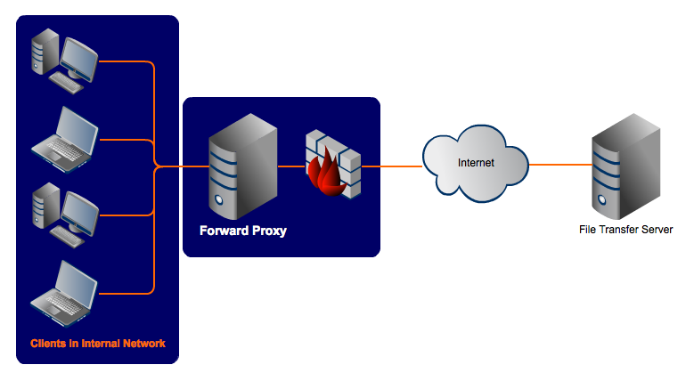
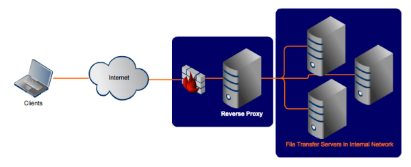

# NETWORK DEVICES

---

# Load Balancers

- Load balancers help to prevent computer systems, websites and webapps from performing suboptimally when dealing with a large influx of requests.
- To reduce the load on a single server, the system is scaled horizontally and we add extra servers, hosting a replica of our app, in parallel. A **load balancer** is used to direct network traffic and distribute the load over all of the servers.
- Load balancers
- When using a load balancer to horizontally scale a system, it is important that the load balancer does not become a single point of failure. With just one load balancer, if the load balancer fails then the whole system goes down - this is clearly not a reliable model. To offset this issue load balancers are often used in high availability pairs. However, in cases where session persistence data is required (that is, throughout a session the same client needs to communicate with same back-end server and the session data needs to be stored), e.g., in e-commerce, it is important that the both load balancers in the pair have close to real time information about the state of the session. This means that the 2 load balancers need to share the same memory, such that if the load balancer that a given clients requests have been routed by fails, the other load balancer can pick up where the other one left off and route the clients requests to the same back-end server. Thus, high-availability pair of load balancers make a given system overall more reliable, but this does come at the cost of extra hardware and complexity.

## Load Balancing Algorithms

Load balancing algorithms are the programmatic logic used by load balancers to decide how requests should be distributed over a software system's resources.

### Static Load Balancing Algorithms

A static load balancing algorithm does not take into account the state of the system when deciding how to distribute tasks/ requests over system resources. Examples include:

- **Round Robin:** network traffic is distributed to a list of servers in rotation. This algorithm works best the servers in the list have roughly equal computing capabilities, e.g., CPU & RAM. This is because this algorithm has no way to favour servers with higher computing capabilities and as a result servers with lower computing capabilities will perform suboptimally relative to those with higher computing capabilities.
- **Weighted Round Robin:** The weighted round robin load balancing algorithm allows site administrators to assign weights to each server, based on criteria like computing power and traffic handling capabilities. Higher weights are assigned to servers that can deal with greater loads, and as such network traffic is directed to these servers more frequently that to servers with a lower weighting.
- **IP Hash:** An algorithm is used that generates a unique hash key from the source and destination IP address of the client and server. This key is then used to allocate the client to a particular server. If a client needs to connect to a session that is still active after disconnection, the hash key can be regenerated and the client directed to the same back end server.

### Dynamic Load Balancing Algorithms

Dynamic load balacing algorithms take into account the current load of each of the computing units (nodes) in the system, such that requests can be favourably directed towards nodes with a lower load and thus receive faster processing. Such algorithms are more complicated that static algorithms, but they can produce excellent results. This is especially true when the execution time varies from task to task. Examples include:

- **Least connection:** checks which server has the fewest connections open at the time of a given request and distributed the request to this server. This algorithm assumes that all requests generate roughly the same amount of load.
- **Least response time:** Takes the average response time of each server and combines that with the number of connections each server has open. Each request is then directed to the server that is expected to process it fastest at that given time.
- **Resource-based:** Specialised software running on each server measure's that server's available CPU and memory. The load balancer recieved this info before distributing network traffic and distributes load accordingly.

---

# Proxy Servers

Proxy servers act as an intermediary between the client and servers twhen the client makes a request for some resources or services. Proxies help to increase privacy, security and performance. There are 2 main types of proxies: forward proxies and reverse proxies.

## Forward Proxies

- A forward proxy is used to recieved and forward client connection requests to some final destination web-server.
- A forward proxy sits between the client and the internet, and establishes a connection to the internet on behalf of the client.
- Forward proxies recieve connection requests from the client and ensure that said requests are valid before forwarding them to their target website on behalf of the client. If a request made by the client is invalid it will redirect it back to the client without processing it.
- Forward rpoxies monitor network traffic on both the client side and web-server sides, meaning that all data from the client and web-servers are routed through the proxy.
- Forward proxies act as a security barrier between clients and the internet to protect clients' computers from any cyber attacks, by monitoring incoming and outgoing traffic in a network system to detect suspicious activity and protect client data.
- A forward proxy can provide proxy services to a group of clients on a common internal network like the one shown below.
  
- In this case the forward proxy acts as an intermediary for all devices on the network. Thus the proxy can serve as a single point of access and control making it easier to enfore authentication, SSL encryption or other security policies.

## Reverse Proxies

- As the name implies, a reverse proxy does the opposite of a forward proxy. Whilst a forward proxy operates on behalf of clients, a reverse proxy operates on behalf of the servers placed behind it. This schematic setup is shown in the diagram below.
  
- Any client recieving a request response from a reverse proxy is completely oblivious to the servers behind it, that are actually providiing the service. As such, a reverse proxy masks the identity of the servers and thus makes it much more difficult for internet-based hackers to aquire sensitive data from the servers.
- Due to their positioning, reverse proxies can also act as load balancers for the servers behind them, and indeed this what happens in most cases.

---

## Firewalls

A firewall is a network security device that monitors incoming and outgoing network traffic and decides whether to allow or block specific traffic based on a pre-defined set of security rules. As such, firewalls are very important in protecting computer systems from attack.

Firewalls can be software or hardware - for maximum security it's best to have both. A **software firewall** is a program installed on a given computer that regulates traffic through port numbers and applications, while a phsyical firewall is a piece of equipment installed between a given network and a gateway.

There are several types of firewall. Some examples include:

### Proxy Firewall:

A proxy firewall is a network security system that protects network resources by filtering messages at the application layer (layer 7 of the OSI model). It serves as a gateway from one network to another and thus can be installed on an organisation's network or on a remote server to provide security for the internal network by monitoring and blocking traffic transmitted to and from the internet. All proxy firewalls are proxy servers, but not all proxy servers are proxy firewalls.

Proxy firewalls can help accomplish the following:

- ensure that only authorised users have access to the resources of a computer network.
- filter out unwantred messages and packets on an internet network.
- protect against network intrusion
- restrict access to sensitive sites or sites that are only relevant to specific users, e.g, preventing employees from using social media websites during working hours.

Proxy firewalls can be installed in the network itself (i.e., between the internet and the internal network), or on each individual computer.

### Statefull Inspection Firewall:

Stateful inspection firewalls are now through of as 'traditional firewalls'. These firewalls allow or block network traffic based on state, port and protocol (i.e., on layer 4 information). All activity from the oppening of a connection until the closing of a connection is monitored by the stateful inspection firewall, with filtering decisions being made based on a set of administrator defined rules.

### Next Generation Firewall:

A next genertion firewall (NGFW) does everything that a stateful inspection firewall does, and more. In addition to stateful inspection, NGFWs can filter packets based on applications and can inspect the data contained in the packets (rather than just the IP address headers). Thus, NGFWs can operate from layer 4 (transport layer) up to level 7 (the application layer) of the OSI model.

Next generation firewall features include:

- **Application awareness:** traffic can be filtered based on application rather than just on port, with traffic from cenrtain applications being blocked.
- **Deep-packet inspection:** the data contained in packets is inspection as well as the port.
- **Intrusion prevention sysems:** monitoring the network for malicious activity and blocking it activity when it occurs. Such monitoring can be signature based (i.e., matching activity to the signatures of well known threats), policy based (i.e., blocking activty that violates security policy) or anomoly based.
- **High performance:** this allows the NGFW to monitor high volumes of network traffic without slowdown. This is an especially important feature considering that some of the security features of NGFWs require proccessing time.
- **External threat intelligence:** communication with a theat intelligence network to insure that threat information is up to date.
