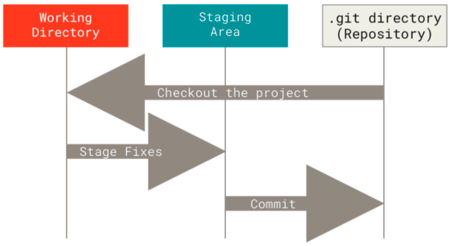
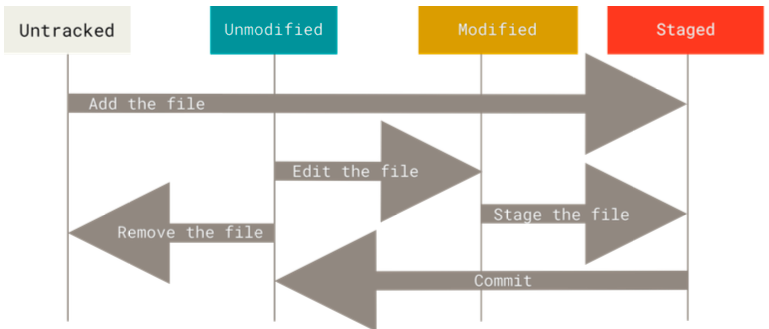

# GIT: BASICS

## What is Git?

- Git is a version control system.
- Git thinks of its data like a series of snapshots of a filesystem. Everytime you make a commit, Git basically takes a picture of what all your files look like at that moment and stores a reference to that snapshot.

## Git States

- Git has three main states that your files can reside in: **modified**, **staged** and **committed**:
  - **modified** - you have changed the file in some way but have not yet commit it to your database
  - **staged** - you have marked a modified file in its current version to go into your next commit snapshot
  - **committed** means that the data is safely stored in your local database
- This leads us to the tree main sections of a Git project: the **working tree**, the **staging area** and the **Git directory**:
  
  - The **working tree** is a single _checkout_ of one version of the project. These files are pulled out of the compressed database in the Git directory and placed on disk for you to use or modify.
  - The **staging area** is a file, generally contained in your Git directory, that stores info about what will go into your next commit.
  - The **Git directory** is where git stores the metadata and object database for your project. This is the most important part of Git, and it is what is copied when you _clone_ a repository from another computer

## Basic Comands

### Initialising a Repository in an Existing Directory

- If you have a project directory that is currently not under version control and you want to start controlling it with Git, you first need to go to that project’s directory and type:
  ```console
  $ git init
  ```
- This creates a new subdirectory named `.git` that constains all neccessary repository files.

### Cloning an Exisiting Repository

- If you want to get a copy of an existing Git repository — for example, a project you’d like to contribute to — the command you need is:
  ```console
  $ git clone <url>
  ```
- Then, every version of every file for the history of the project is pulled down into your local copy of the repo.

### Recording Changes to the Repository

- Every file in your working directory is either **tracked** or **untracked**. **Tracked** files are files that git knows about and **untracked** files are everything else.
- As you edit tracked files, git will see them as modified as they have been changed since the last commit.
- As you work you selectively stage these modified files and then commit all those staged changes, and then the cycle repeats.
  
- To check the **status** of files in your git repo use the command:
  ```console
  $ git status
  ```
- To track a new file or stage a file for commit, use the command:
  ```console
  $ git add <file-name>
  ```
- To make a commit, use the command:
  ```console
  $ git commit -m "<add-commit-message-here>"
  ```

### Viewing Changes Made

- The `git status` command tells us which files have been made, but does not tell us what these changes are.
- We can use `git diff` to view changes that are not yet staged, and also what changes have been made that are staged for commit.
- To see what you've changed but not yet staged, use the command:
  ```console
  $ git diff
  ```
  with no other arguments.
- To changes in files that you have staged but not yet commited, use the command:
  ```console
  $ git diff --staged
  ```
  This will compare your staged changes to your last commit.

### Removing Files

- To remove a file from git you have to remove it from your tracked files and then commit.
- The following commands remove the file from git AND from your working tree.
  ```bash
  $ git rm <file-name> #removes file from git AND working tree, and stages its removal
  $ git commit -m "<-commit-message-here->
  ```
- To remove a file from git but keep it in your working tree (i.e., keep it on your hard drive) run the following commands:
  ```bash
  $ git rm <file-name> -- cached #removes file from git and stages its removal
  $ git commit -m "<-commit-message-here->
  ```

### Moving & Renaming Files

- Git doesn't explicitly track file movement.
- Git has a command `mv` that we can use to rename a file.
- This is done as follows:
  ```console
  $ git mv <-original-file-name-> <-new-file-name->
  ```

### Viewing the Commit History

- To view the git commit history, run the command;
  ```console
  $ git log
  ```
- By deafult with no arguments, as above, `git log` lists the commits made in that repository in **reverse chronological order**, so the most recent commits show up first.
- There are a variety of options to the `git log` command that can help to show exactly what you're looking for. Here are some of the more helpful ones.

  - ```console
    $ git log -p
    ```
    This command shows the difference (the _patch_ output) introduced in each commit.
  - ```console
    $ git log -n
    ```
    where n is a number, shows us the last n entries.
  - The `--pretty` tag allows us to change the log output format to something other than the default. The most interesting option value is `--pretty=format:" <-format-specifiers-here->`. Some useful specifiers are:

    - `%h` - abbreviated commit hash
    - `%an` - author name
    - `%ar` - relative author date
    - `%s` - subject, i.e., commit message

    These can be combined, `--pretty=format:"%h - %an, %ar : %s` will produce an output like the following:

    ```console
    $ git log --pretty=format:"%h - %an, %ar - %s"
    ch83a7c - Maisie Johnson, 1 day ago : Add some code
    hj25b1b - Maisie Johnson, 1 day ago : Initial commit
    ```

  - The `format` option is particularly useful with the `--graph` option. This option adds an ASCII graph showing your branch and merge history. E.g.,
    ```console
    $ git log --pretty=format:"%h %s" --graph
    ```

## Undoing Things

- BE CAREFUL with undoing things, sometimes you can't undo your undoes.

### Undoing a Commit

- Suppose you have committed too early and possibly forget to add some files, or you mess up your commit message. In this case, you can redo that commit, making the additional changes you forgot, stage them and then commit again using the `--amend` option.
- This works as follows:
  ```console
  $ git commit -m 'Initial commit'
  $ git add forgotten_file
  $ git commit --amend -m "new message"
  ```
- The process above leaves you with a single commit message - i.e., the second commit replaces that of the above, but contains the staged contents from both commits.
- If you don't stage anything between the 2 commits, then nothing extra gets added and you just change the commit message.

### Unstaging a Staged File

- To unstage a file that you don't want to commit, run the command:
  ```console
  $ git restore --staged <-name-of-file-to-be-unstaged->
  ```

### Unmodifying a Modified File

- You can undo that changes to a modified file and revert it back to its state when it was last committed using the command:
  ```console
  $ git restore <-name-of-file-to-unmodify->
  ```
- **NOTE**: It’s important to understand that `git restore -- <file>` is a dangerous command. Any local changes you made to that file are gone — Git just replaced that file with the last staged or committed version. Don’t ever use this command unless you absolutely know that you don’t want those unsaved local changes.

- If you would like to keep the changes you’ve made to that file but still need to get it out of the way for now, you can use stashing and branching.
