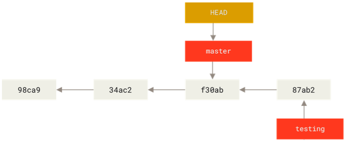
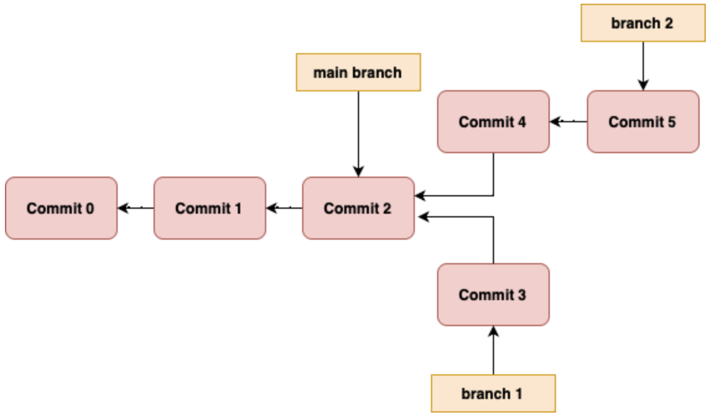
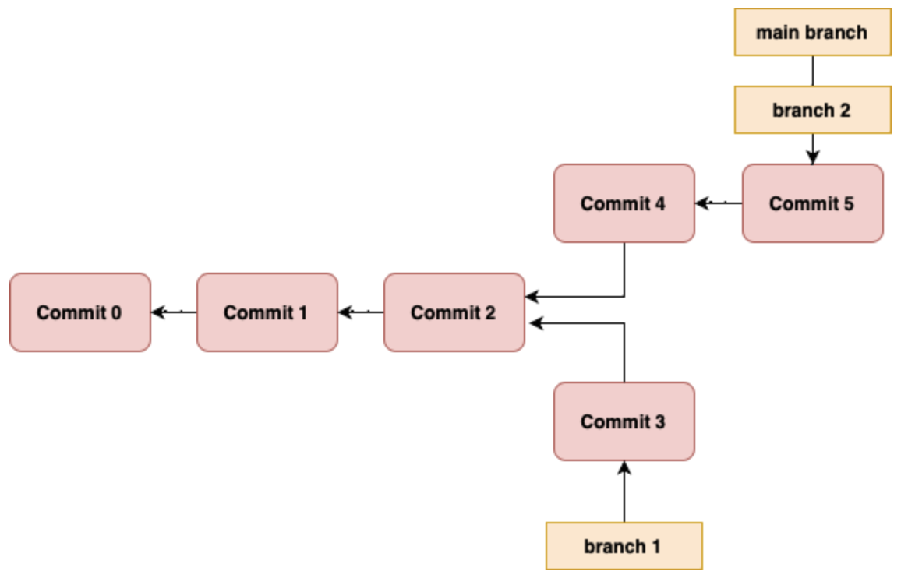
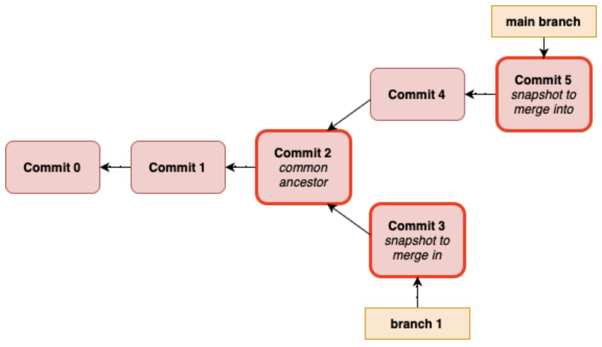
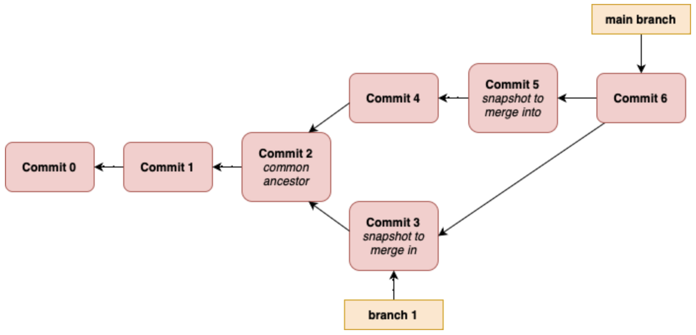

# GIT: BRANCHING

## How Does Git Store Data?

- Git doesn't store data as a series of changesets or differences, but instead as a series of snapshots.
- Git stores 3 types of object:
  - **Commit objects** - whenver you make a commit, Git stores a commit object that contains:
    - a pointer to the snapshot of the content you've staged, i.e., a hash identifier to the **tree object** of that commit
    - the commit author's name
    - the commit author's email address
    - the commit mesage
    - pointers to the commit(s) before it - zero pointers for the initial commit, one parent for a normal commit, and multiple parents for a commit resulting from the merge of 2 or more branches
  - **Tree objects** - a tree object contains a unix filesystem style (but a bit simplified) tree of the file & directory structure of the repo at the time of a given commit. The tree object essentially contains the file names mapped to the hash identifiers of their **blob** representation at the time of the given commit.
  - **Blob objects** - a blob object crepresents the actual content of files in your project. A blob object is created every time you tsgae a file.
- When we refer to a git **snapshot**, what we mean is the combination of the tree object and the blobs that it points to.

  

- A **branch** in git is simply a movable pointer to one of your commits.
- By deafult when you make a git repository, you're given a branch called `main` and this branch points to the last commit you made.

### Creating a New Commit:

When you commit changes in git, the following 3 things happen:

1. Git generates a new tree object, representing the current working tree, meaning it maps all existing file names to their correct blob representations.
2. A new commit object will be generated, storing the information like commit message, author, time of commit, hash of its parent commit and also the reference to the new tree object.
3. The branch pointer replaces the old commit hash with the new one to keep pointing to its most recent commit.

## Creating a New Branch

- Recall that a git branch is just a movable pointer to a commit.
- When you create a new branch, an additional movable pointer is created.We do this as follows:
  ```console
  $ git branch <-branch-name->
  ```
- At the time of the creating this branch, the branch pointer is towards the commit that you're currently on. _(see diagram 1)_
- Git keeps track of which branch you're on using a special pointer called `HEAD` - i.e., `HEAD` points to local branch you are currently working on. _(see diagram 2)_

  |  |  |
  | ---------------------------- | ------------------------------ |
  | _diagram 1_                  | _diagam 2_                     |

## Switching Branches

- To switch to an existing branch, you run the following command:
  ```console
  $ git checkout <-branch-name->
  ```
- This moves `HEAD` to point to the branch that you have switched to.
- If you then make a commit on the new branch, the branch pointer will move and point to this commit, whilst the branch pointer for the other branch remains pointing at the previous commit. Since the `HEAD` pointer points to the branch, the head pointer also moves forward. _(see diagram 3)_
- If you then `git checkout` back onto the original branch, the `HEAD` pointer then moves back to the other branch, which is pointing to the previous commit. The files in your working directory would also be reverted back to the snapshot that the original branch is pointing to. _(see diagram 4)_

  |  |  |
  | ---------------------------------------------- | --------------------------------------------- |
  | _diagram 3_                                    | _diagram 4_                                   |

## Basic Branching and Merging

- To create a new branch and switch to it at the same time, run the command:
  ```console
  $ git checkout -b <-new-branch-name->
  ```
- If you make changes on the new branch, git won't let you switch back onto the main branch changes until you have committed or reverted the changes (note that there are actually ways around this, i.e., git stashing).
- Suppose that you have switched back onto the main branch - git has reset your working directory to look like it did the last time you committed on the branch.
- Now suppose you make another branch to work on a different part of your project code, and you make some changes on this branch and now you want to merge them back into the main branch. The situation is this scenario is illustrated in _diagram 5_.
- You can merge branch 2 back into the main branch using the commands (assuming that you are currently on branch 2):
  ```console
  $ git chekout main
  $ git merge <-name-of-branch-to-merge->
  ```
- Assuming that there is no divergent work, git will merge the branches by moving the `main` branch pointer to the last commit on the branch you merged with, as shown in _diagram 6_.

  |  |  |
  | ----------------------------------- | ------------------------------------------ |
  | _diagram 5_                         | _diagram 6_                                |

- Now suppose you wanted to wanted to merge branch 1 back into the main branch. To do this you would agin run the commands:
  ```console
  $ git checkout main
  $ git merge <-name-of-branch-to-merge>
  ```
- Behind the scenes, git handles this merge a bit differently because the commit that the main branch points to is not a direct ancestor of the branch you're trying to merge with.
- Git handles this by doing a simple 3 way merge, using the commit that each of the 2 branches points to, and the most recent common ancestor of the 2 branches (the 2 branches being the main branch and branch 1). _(see diagram 7)_
- Instead of just moving the branch pointer forward, Git creates a new snapshot that results from the 3-way merge and automatically creates a new commit that pointss to it. This is referred to as a **merge commit**, and it is special in that it has more than one parent. _(see diagram 8)_

  |  |  |
  | --------------------------------------- | ----------------------------- |
  | _diagram 7_                             | _diagram 8_                   |

## Deleting Branches

- Once you have merged a branch into your main branch, you have no further need for that branch.
- To remove a branch, run the following command:
  ```console
  $ git branch -d <-name-of-branch-to-be-deleted->
  ```

## Basic Merge Conflicts

- Sometimes merging branches is more complicated than outlined above.
- This occurs when you have changed the same part of the same file differently in the 2 branches that you are merging - in this case git won't be able to merge the cleanly.
