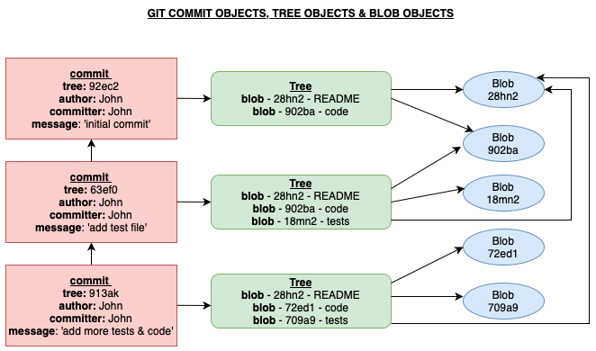
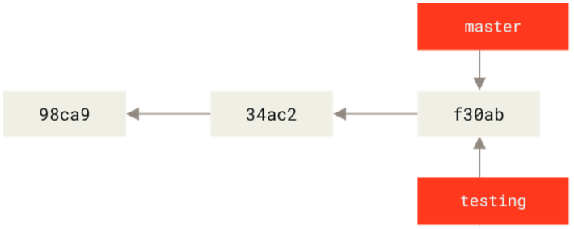
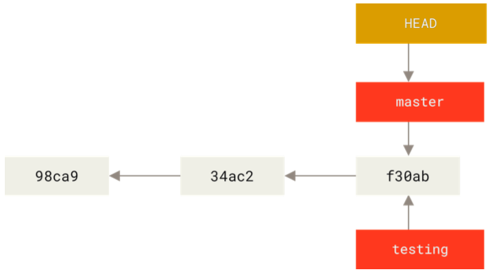

# GIT: BRANCHING

## How Does Git Store Data?

- Git doesn't store data as a series of changesets or differences, but instead as a series of snapshots.
- Git stores 3 types of object:
  - **Commit objects** - whenver you make a commit, Git stores a commit object that contains:
    - a pointer to the snapshot of the content you've staged, i.e., a hash identifier to the **tree object** of that commit
    - the commit author's name
    - the commit author's email address
    - the commit mesage
    - pointers to the commit(s) before it - zero pointers for the initial commit, one parent for a normal commit, and multiple parents for a commit resulting from the merge of 2 or more branches
  - **Tree objects** - a tree object contains a unix filesystem style (but a bit simplified) tree of the file & directory structure of the repo at the time of a given commit. The tree object essentially contains the file names mapped to the hash identifiers of their **blob** representation at the time of the given commit.
  - **Blob objects** - a blob object crepresents the actual content of files in your project. A blob object is created every time you tsgae a file.
- When we refer to a git **snapshot**, what we mean is the combination of the tree object and the blobs that it points to.
  
- A **branch** in git is simply a movable pointer to one of your commits.
- By deafult when you make a git repository, you're given a branch called `main` and this branch points to the last commit you made.

### Creating a New Commit:

When you commit changes in git, the following 3 things happen:

1. Git generates a new tree object, representing the current working tree, meaning it maps all existing file names to their correct blob representations.
2. A new commit object will be generated, storing the information like commit message, author, time of commit, hash of its parent commit and also the reference to the new tree object.
3. The branch pointer replaces the old commit hash with the new one to keep pointing to its most recent commit.

## Creating a New Branch

- Recall that a git branch is just a movable pointer to a commit.
- When you create a new branch, an additional movable pointer is created.We do this as follows:
  ```console
  $ git branch <-branch-name->
  ```
- At the time of the creating this branch, the branch pointer is towards the commit that you're currently on.
  
- Git keeps track of which branch you're on using a special pointer called `HEAD` - i.e., `HEAD` points to local branch you are currently working on.
  

## Switching Branches

- To switch to an existing branch, you run the following command:
  ```console
  $ git checkout <-branch-name->
  ```
- This moves `HEAD` to point to the branch that you have switched to.
- If you then make a commit on the new branch, the branch pointer will move and point to this commit, whilst the branch pointer for the other branch remains pointing at the previous commit.
