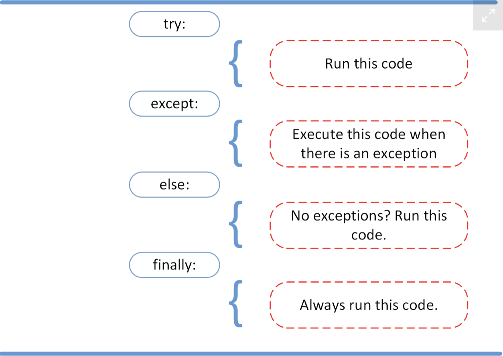

# EXCEPTIONS

## Basics

- Python terminates as soon as it encounters an error
- There are 2 main types of error - **syntax errors** and **exceptions**
- A **syntax error** refers to an incorrect statement in our code. For the program to run we must fix the syntaxt error and run the program again.
- An **exception** occurs when syntactically correct Python code results in an error. Python will indicate which _type_ of exception error has occured.

### Raising an Exception

- We can use `raise` to throw an excetion if a condition occurs.
- The statement can be complemented with a custom exception.
- An example of the syntax for this is shown below:

  ```Python
      x = 10
      if x > 5:
        raise Exception('x should not exceed 5.')
  ```

- When this code is run, the program will **come to a halt** and display the exception on the screen, with the given message.

### Handling Exceptions

- To catch and handle exceptions in Python we use the `try` and `except` block.
- Python executes the code following the `try` statement as part of the normal program. The code that follows the `except` statement is executed following any exceptions in the preceeding `try` clause.
- The `except` clause determines how the program responds to exceptions.
- If an exception does occur, the program will **NOT** crash. Instead, the program will continue running and will also inform us that the exception occured.
- The syntax for a `try` and `except` clause is as follows:

  ```Python
      x = 5
      y = 0
      try:
          z = x / y
      except ZeroDivisionError:
          print("cannot divide by zero")
  ```

- We can add an `else` clause to instruct the program to execute a block of code **only in the absence of exceptions**. For example:

  ```Python
  x = 5
  y = 0
  try:
      z = x / y
  except ZeroDivisionError:
      print("cannot divide by zero")
  else:
      print(f" {y}/{x} is {z}")
  ```

- If there is some code that needs to be run at the end regardless of whether or not there are any exceptions, we can add a `finally` clause at the end. The code in the finally statement is always executed.
  

## Look Before You Leap (LBYL) vs Easier to Ask for Permission than for Forgiveness (EAFP)

- There are 2 general strategies for dealing with errors and exceptions in Python:
  1. **Prevent** errors or exceptional situations from happening (**LBYL**).
  2. **Handle** errors or exceptional situations after they happen (**EAFP**).
- With the **look before you leap** style is when you first check whether something will succeed and then only proceed if you know that will work. An example of LBYL style is shown below:

  ```Python
      # Look Before You Leap style
      if "possible_key" in data_dictionary:
          value = data_dictionary["possible_key"]
      else:
          value = "not in dictionary"
  ```

- The **easier to ask for forgiveness than for permission** style suggests that you should first do what you expect to work and if that doesn't work and an exception happens you should catch that exception and handle it appropriately. An example of the EAFP style is shown below:

  ```Python
  # Easier to Ask for Forgiveness than for Permission style
  try:
      value = data_dictionary["possible_key"]
  except KeyError:
      value = "not in dictionary"
  ```

## Effectively Raising Exceptions

- An **exception** represents an error or indicates that something is going wrong in our program.
- Some programming languages, such as C, encourage you to return error codes, which you _check_.
- In contrast, Python encourages you to raise exceptions, which you _handle_.
- When a problem occurs in a Python program, python automatically raises an exception.
- Every raised exception has a **traceback**, which is a report containing the sequence of calls and operations that traces down to the current exceptions.
- In Python, the traceback header is `Traceback (most recent call last)` in almost all cases. This will be followed by the actual call stack, then the exception name followed by its message.
- Exceptions cause a program to terminate unless they are handled using a `try... except` block.
- In order to be able to effectively handle exceptions, we need to anticipate which exceptions can happen. We can then raise these exceptions if they happen using the `raise keyword`
- In Python you can raise either built in or custom exceptions.

### Built-in Exceptions

- **Built-in** exceptions are built-in to Python and can be used directly in your code without importing anything.
- Python has a set of built-in exceptions that are structured in a class heirachy with the `BaseException` class at the top. One of the most frequestly used subclasses of `BaseException` is `Exception`.
- The `Exception` class is fundamental to Python - it is the base class of most of Python's built in exceptions and is also the class that you'll typically use to create custom classes.
- A link to Python's **exception class heirachy** can be found [here](https://docs.python.org/3/library/exceptions.html#exception-hierarchy).
- Some notable concrete exceptions are:
  |Exception Class | Description|
  |----------------|---|
  |`ImportError`| Appears when an import statement has trouble loading a module|
  |`ModuleNotFound Error`| Happens when import can't locate a given module |
  |`NameError`| Appears when a _global_ or _local_ name isn't defined|
  |`AttributeError`| Happens when an attribute reference or assignment fails|
  |`IndexError`| Occurs when an indexing operation on a sequence uses an out-of-range-index|
  |`KeyError`| Occurs when a key is missing in a dictionary|
  |`ZeroDivisionError`| Appears when the second operand in a dividion or modulo operation is 0|
  |`TypeError`| Happens when an operation, function, or method operates on an object of inappropriate type|
  |`ValueError`| Occurs when an operation, function, or method recieves the right type of argument but wrong value|

### Coding and Raising Custom Exceptions

- If one of Python's built-on functions isn't suitable fo a given situation then you can define a custom one.
- To do this you **must** inherit from another exception class, typically `Exception`. The custom exception class typically contains just the `pass` keyword, as the most important aspect of a custom exception is usually its name.
- You can then raise this custom using the `raise` keyword.
- For example:

  ```Python
      class CustomException(Exception):
          pass

      if <some-experession-that-returns-a-boolean-value>:
          raise CustomException("optional message")
  ```

## Catching Multiple Exceptions

Often there are multiple exceptions that can happen for a given piece of code. There are several ways we can handle multiple possible exceptions.

### Using Multiple Except Clauses

- We can have multiple `except` blocks following a `try` clause - one for each individual exception. Any exceptions raised in the try block will trigger the associated `except` clause.
- If there are multiple except clauses, your program will only run the first one that triggers and then ignore the rest.
- Using multiple `except` clauses is the right approach if each possible type of exception needs to be handled differently.

  ```Python
      try:
          num1 = float(input("Enter your first number: "))
          num2 = float(input("Enter your second number: "))
          print(f"{num1} / {num2} is {num1/num2}")
      except ValueError:
          print("You must eneter a number")
      except ZeroDivisionError:
          print("You can't divide by zero")
  ```

### Single Except Clause with a Tuple

- If we want to perform the same actions in response to different exceptions then we can use a single except clause and put the different exceptions that we want to catch into a tuple.
- In this case the same code is executed if any one of the exceptions is caught.
- We can still identify which exception was caught by using the `type()` function and `__name__` attribute. For example:

  ```Python
      try:
          num1 = float(input("Enter your first number: "))
          num2 = float(input("Enter your second number: "))
          print(f"{num1} / {num2} is {num1/num2}")
      except (ValueError, ZeroDivisionError) as error:
          print(f"A {type(error).__name__} has occured")
  ```

## Uselful Links

- [Python Exceptions: An Introduction](https://realpython.com/python-exceptions/)
- [LBYL vs EAFP: Preventing or Handling Errors in Python](https://realpython.com/python-lbyl-vs-eafp/)
- [Python's raise: Effectively Raising Exceptions in Your Code](https://realpython.com/python-raise-exception/)
- [How to Catch Multiple Exceptions in Python](https://realpython.com/python-catch-multiple-exceptions/#identify-which-python-exception-was-caught)
