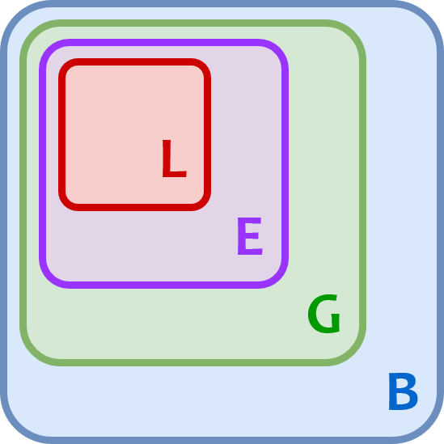

# NAMESPACES AND SCOPE

## Namespaces

- A **namespace** is a structure used to organise symbolic names assigned to objects in a python program
- A namespace is essentially a dictionary - the keys are the symbolic names and the values are the objects themselves. Each key-value pair maps a name to its corresponding object.
- There are 4 types of namespace:
  1. Built-in
  2. Global
  3. Enclosing
  4. Local
- The different types of namespace have different lifetimes. As a program executes, python creates namespaces as necessary and deletes them when they are no longer needed.

### Built-in Namespace

- The **built-in namespace** containes the names of all of python's built-in objects.
- These objects are available at all times when python is running.
- We can use the syntax `dir(__builtins__)` to list the names of objects in the built-in namespace.

### Global Namespace

- The **global namespace** contains the names of objects defined at the level of the main program.
- The global namespace is created when the main program body starts and remains in existence until the interpreter terminates
- There can be **more than one** global namespace - the python interpreter creates a global namespace for any **module** that your program loads with the import statement.
- The built-in function `globals()` returns a reference ti the current global namespace dictionary, and we can use it to access objects in the global namespace.

### Local and Enclosing Namespaces

- Python creates a new namespace whenever a function **executes**, and that namespace is local to the function and remains in existence until the function terminates.
- The **local namespace** for a function exists only whilst the function is executing.
- Suppose a function g is defined inside a function f, and the function f calls the function g inside its body, as shown below.
  ```python
        def f(x):
        z = x + 1
        def g(x):
            y2 = y**2
            return y2
        return z + g(x)
        print(f(2))
  ```
- In this case, the namespace creates for the function f whilst it is executing is the **enclosing namespace** and the namespace created for g whilst it is executing is the **local namespace**.
- Each of the local and enclosing namespaces remain in existence until its respective function terminates.
- The built-in function `locals()`can be used to access the local namespace.
- When called within f(), locals returns a dictionary representing the function's local name space.
- If `locals()` is called outside the body of a function, i.e., if it is called within the main function, the it behaves the same as globals().

## Scope

- Since there are distinct namespaces in python, several instances of a partiular name can exist simultneously in different namespaces.
- So, how does python know which x we mean if the name x exists in several namespaces? The answer lies in the concept of scope.
- The **scope** of an object name in python is the region of a program in which that object name has meaning.
- Python searches for a given name x in the following namespaces in the order shown:
  | <ol><li>Local - if you refer to x inside a function, then the interpreter first searches for it in the innermost scope that’s local to that function.</li><li>Enclosing - if x isn’t in the local scope but appears in a function that resides inside another function, then the interpreter searches in the enclosing function’s scope.</li><li>Global - if neither of the above searches is fruitful, then the interpreter looks in the global scope next.</li><li>Built-in - if it can’t find x anywhere else, then the interpreter tries the built-in scope.</li></ol> |  |
  | -------------------------------------------------------------------------------------------------------------------------------------------------------------------------------------------------------------------------------------------------------------------------------------------------------------------------------------------------------------------------------------------------------------------------------------------------------------------------------------------------------------------------------------------------------------------------- | -------------------------------- |
- This is the LEGB rule - the python interpreter searches for names from the inside out

### Modifying Variables Out of Scope

- A function cannot modify immutable variables out of its local scope.
- A function can modify a mutable variable outside local scope, if it is modified i place, but it cannot reassign a mutable variable.
- If we do need to modify a variable in the **global** scope from within a function we can use the `global <var-name>` declaration - this indicates that whilst the function is executing, if we reference the name `<var-name>` we are referring to the `<var-name>` in the global namespace.
- Similarly, if we want to modify a variable in the **enclosing** namespace, we use the `nonlocal <var-name>` declaration.
