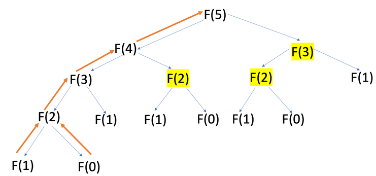

# RECURSION

- In Python, it is possible for a function to call itself.
- A function that calls itself is a **recursive** funciton.

## Why use recursion?

- Most programming problems are solvable without recursion.
- However, some situations lend themselves to self-referential definition - such problems are nicely solvable using recursion.
- An example of such a situation is tree traversal - becuase these are nested structures they readily fit a recursive definition.

## Recursion in Python

- When you call a function in Python, the interpreter creates a new local namespace so that names defined within that function don't collide with identical names defined elsewhere.
- This happens when a function calls itself in Python and thus even though there are objects produced with identical names in every recursively call, nothing collides because these names exist in different namespaces.
- The Python interpreter limits the maximum number of times a function can call itself recursively, and when it reaches this limit it raises a `RecursionError` exception. This maximum number of times a function can call itself recursively is the **maximum recursion depth**.
- We can see and set this as follows:

  ```python
  >>> import sys
  >>> sys.getrecursionlimit()
  1000

  >>> sys.setrecursionlimit(2000)
  >>> sys.getrecursionlimit()
  2000
  ```

- To avoid a recursive function calling itself indefinitely, recursive functions follow this general pattern:
  - There are one or more base cases that are directly solvable without the need for a recursive call.
  - Each recursive call moves the solution progressively closer to the base case.

## Some Recursive Problem Examples

### Calculate Factorial

```python
def factorial(n):
    if n == 1:
        return 1
    else:
        return n * factorial(n-1)
```

### Number of Items in Nested List

```python
# nested list: ['a', ['b', ['c', ''d', 'e'], 'f'], ['g', 'h']]

# want to count number of items in list that are not themselves a list therefore base case is that item is not a list

def count_nested_list_items(input_list):

    count = 0

    for item in input_list:
        if isinstance(item, list):
            count += count_nested_list_items(item)
        else:
            count += 1 # <- Base case

    return count
```

## Maintaining State

- Behind the scenes in Python, each recursive call adds a stack frame (containing its own execution context) to the call stack until we reach the base case.
- Once the base case has been reached, the stack begins to unwind as each call returns its results.
- Since each recursive call has its own execution context, we must mainstate by either of the following:
  - Thread the state through each recursive call so that the current state is part of the call's execution context.
  - Keep the state in the global scope.

## Memoization

- We know that recursive functions call themselves several times. In some cases, the recursive function will call istelf with the **same input value(s)** several times.
- Instead of a new call everytime, it is often more efficient to store the result of previous calls.
- This technique is called **memoization**.
- **Memoization** speeds up the execution of expensive recursive functions by storing previously calculated results in a cache.
- Thus, when a second recursive call with the same input is made, the function just has to look up the corresponding result and return it without having to run the computation again. Such results can be referred to as **memoized** or **cached**.
- With memoization, you only have to traverse up the call tree of depth n once after returning from the base case. For example, consider a function that calculates the nth Fibonacci number. Using memoization the results retrieved from the cache are shown in yellow below, and the orange path shows that no input to the Fibonacci sequence is called more than once.
  
- This significantly reduces the time complexity of the algorithm.

### Implementing Memoization with a Decorator

- A nice way of implementing memoization is using a decorator to cache the return values of a recursive function.
- An example below is shown for a function that returns the nth Fibonacci number.

  ```python
  import functools

  def cache(f):
      cache = {}
      @functools.wraps(f)
      def wrapper(*args, **kwargs):
          if str(*args, **kwargs) not in cache:
              cache[str(*args, **kwargs)] = f(*args, **kwargs)
          return cache[str(*args, **kwargs)]
      return wrapper

  @cache
  def fibonacci(n):
      if n == 0:
          return 0
      elif n == 1:
          return 1
      else:
          return fibonacci(n - 1) + fibonacci(n - 2)
  ```

- Note that the decorator in the example above has been written to work with any function, with arbitrary arguments. The cache is implemented with a dictionary, which needs a hashable key, hence the `str(*args, **kwargs)` line. If we wanted to write a decorator to implement memoization specifically for the fibonacci function, this would look like:

  ```python
  import functools

    def fib_cache(f):
        cache = {}
        @functools.wraps(f)
        def wrapper(n):
            if n not in cache:
                cache[n] = f(n)
            return cache[n]
        return wrapper
  ```
